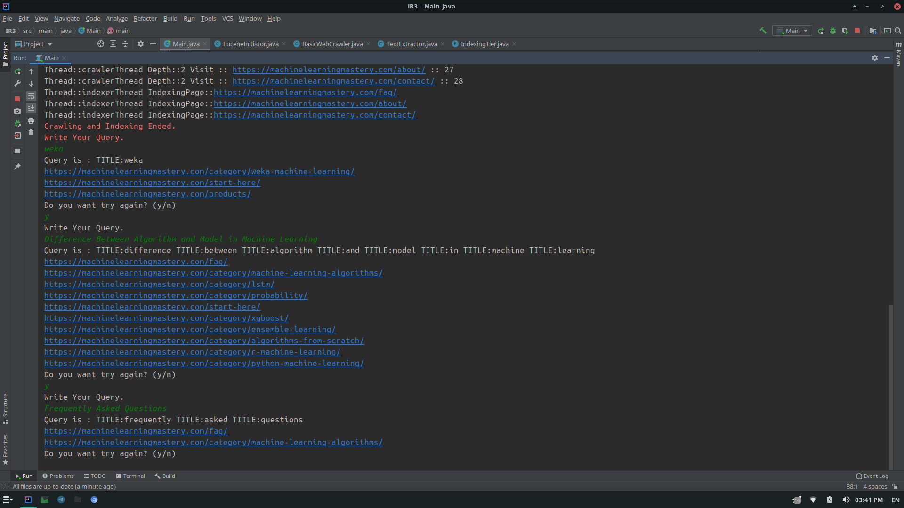

# basic-concurrent-search-engine

This Application is written for introduction to information retrieval course.

# about

This Application is a basic concurrent search engine using [Java programming language](https://www.java.com/en/) and [Lucene](https://lucene.apache.org/) engine.

Jsoup library is used for crawling and For parallel crawling and indexing, the Singleton pattern is used, which holds our threads in place.

# views

